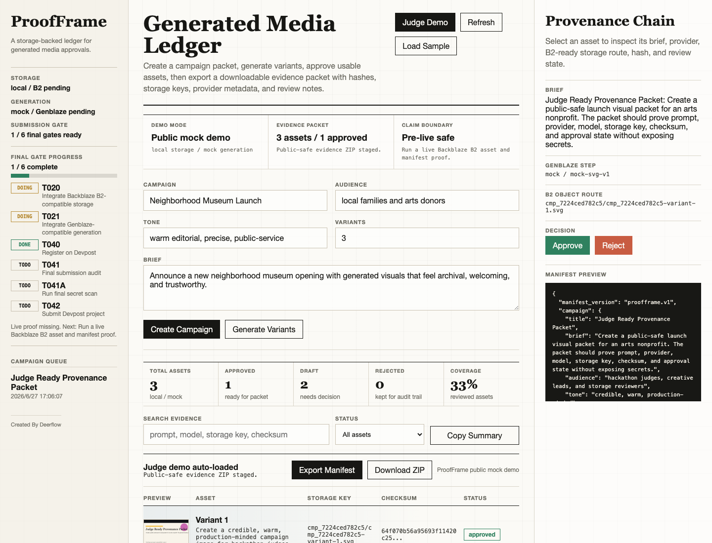
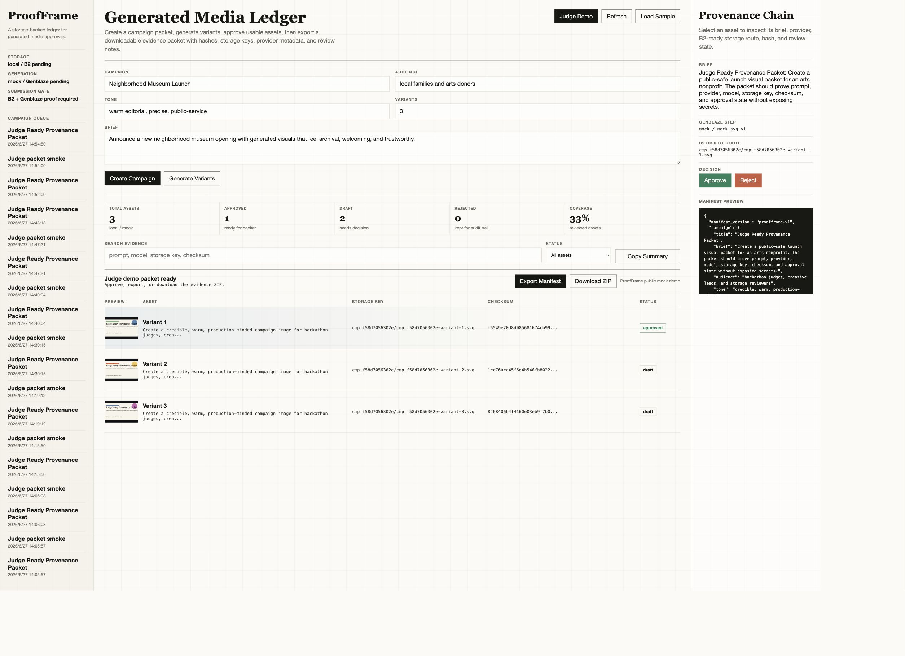

# ProofFrame

ProofFrame is a provenance-first generative media vault for the Backblaze Generative Media Hackathon.

It turns a creative brief into a reviewable asset packet: generated media, prompt history, model/provider metadata, hashes, approval state, and a shareable manifest. The local demo uses deterministic generation and local storage; the final hackathon gate is to verify the same packet flow through Genblaze-backed generation and Backblaze B2-compatible storage. The product goal is not "yet another image generator"; it is the missing operations desk for teams that need to know where an AI asset came from, whether it is approved, and how to reproduce or retire it.

## Hackathon Choice

Selected competition: [Backblaze Generative Media Hackathon](https://backblaze-generative-media.devpost.com/)

Public mock demo: [Hugging Face Space Judge Mode](https://adjcjh-backblaze-proofframe.hf.space/?judge=1) (credential-free local/mock mode; final B2 and Genblaze live proof remains gated).

Why this one:

- Online Devpost format with a clear August 3, 2026 5:00 PM EDT deadline, which is August 4, 2026 05:00 in Beijing.
- Cash prizes, including a $7,000 grand prize.
- Moderate visible participant count compared with larger AI agent events.
- Sponsor requirements are specific enough to reward meaningful integration: Genblaze plus Backblaze B2.
- A polished, useful product can beat a raw model demo here.

## Core Documents

- `docs/research.md`: competition search, candidate comparison, selected-event evidence.
- `docs/prd.md`: product PRD.
- `docs/spec.md`: technical specification.
- `docs/integrations.md`: B2 and Genblaze readiness gates.
- `docs/deployment.md`: public demo deployment runbook.
- `docs/devpost_draft.md`: copy-ready Devpost draft with claim gates.
- `docs/demo_script.md`: demo video script and shot list.
- `docs/evidence_package.md`: Devpost evidence package and copy bank.
- `docs/public_claim_freeze.md`: public claim boundaries before final submission.
- `docs/verification.md`: local, Docker, live proof, and secret-scan runbook.
- `docs/submission.md`: registration and submission plan.
- `docs/todo.md`: human task board.
- `tasks.json`: queryable task ledger.

## Local Task Commands

```bash
python3 scripts/task.py list
python3 scripts/task.py list --status todo
python3 scripts/task.py search Genblaze --status doing
python3 scripts/task.py show T001
python3 scripts/task.py add T099 "Record final demo" --phase "P4 Submit" --owner controller --after T041
python3 scripts/task.py done T001
python3 scripts/task.py blocked T010 --note "Requires account setup"
```

## Planned Stack

- Backend: Python, FastAPI, SQLite.
- Storage: local storage for offline demo, Backblaze B2 S3-compatible storage for submission.
- Generation: deterministic mock provider for local tests, Genblaze/OpenAI-compatible media provider adapter for real runs.
- Frontend: production-grade browser UI with `apps/web/index.html` as entry point.
- Packaging: Dockerfile and release checklist.

## Current Status

Stage 0 is complete: selected competition, repo, PRD/spec/todo, Agent Bus team, official-rule scout report, and GitHub setup.

Stage 1 is complete enough for local demo iteration: FastAPI MVP skeleton, mock generation, local storage, manifest export, downloadable evidence packets, one-click Judge Demo packets, and the Proof Ledger browser UI.

Stage 2 is in progress: B2-compatible storage code and a Genblaze/GMICloud image provider path exist, but live B2 and Genblaze runs still need credentials/provider verification before final submission claims.

Stage 3 preparation is active: the public mock demo is deployed, Review Console polish is captured, Devpost/evidence/claim-freeze docs are ready for the final sponsor-integration pass, API evidence exports fail closed if secret-like values appear, and the app now displays a fail-closed submission gate dashboard plus a judge recording slate for final task/live-proof status.





## Run Locally

```bash
python3.11 -m venv .venv
. .venv/bin/activate
pip install -e ".[dev,integrations]"
pytest
uvicorn proofframe.app:app --reload --port 8088
```

Then open `http://127.0.0.1:8088/`.

## Integration Readiness

```bash
. .venv/bin/activate
python scripts/check_integrations.py
python scripts/live_proof.py --preflight-only
python scripts/run_final_live_proof.py --preflight-only
python scripts/live_env_handoff.py
python scripts/final_env_wizard.py --check-only
python scripts/devpost_form_kit.py
python scripts/claim_lint.py
python scripts/demo_storyboard.py
python scripts/sponsor_fit_audit.py
python scripts/demo_readiness.py
python scripts/award_readiness.py --min-score 75
python scripts/final_submission_control.py
python scripts/submission_audit.py
python scripts/devpost_packet.py
python scripts/submission_bundle.py
```

The browser UI and `GET /api/submission/gate` expose the same fail-closed final gate: required task status, Devpost packet presence, and final B2/Genblaze evidence readiness.
`scripts/submission_bundle.py` creates a safe manifest of public submission artifacts, screenshots, checksums, Devpost copy mode, and remaining gate blockers.
`scripts/live_env_handoff.py` creates a redacted B2/Genblaze credential handoff report so final proof setup can be checked without printing keys.
`scripts/final_env_wizard.py` creates a local git-ignored `.env.final.local` with 0600 permissions, can prefill non-secret B2/default values, and uses hidden prompts for credential values.
`scripts/run_b2_live_proof.py` verifies the Backblaze B2 storage path independently with mock generation, so T020 can close before Genblaze credentials are ready.
`scripts/devpost_form_kit.py` turns the safe packet into field-by-field Devpost copy with length checks and a strict final gate.
`scripts/run_final_live_proof.py` is the final one-command live runner: once B2 and Genblaze env vars are present, it starts the app, verifies `/api/health` reports `b2` plus `genblaze`, writes sanitized final evidence, and stops the server.
`scripts/claim_lint.py` keeps pre-live public copy from claiming completed Backblaze B2 or Genblaze proof before evidence exists.
`scripts/demo_storyboard.py` keeps the demo video timeline under 3 minutes and tracks the public video URL as a final gate.
`scripts/sponsor_fit_audit.py` checks that Backblaze B2 and Genblaze are explained as product-critical sponsor paths without overclaiming live proof.
`scripts/demo_readiness.py` keeps the mock demo recording package ready while failing strict final mode until live B2/Genblaze proof and the final secret scan are complete.
`scripts/award_readiness.py` scores sponsor fit, provenance depth, demo readiness, claim safety, and final closure so polish work stays aligned with judge expectations.
`scripts/final_submission_control.py` aggregates the gate, form kit, storyboard, credential handoff, and award reports into one final Devpost control tower.

B2 mode intentionally fails closed unless `B2_ENDPOINT_URL`, `B2_BUCKET`, `B2_KEY_ID`, and `B2_APPLICATION_KEY` are set. Genblaze mode intentionally fails closed unless a Genblaze/GMI key and `GENBLAZE_IMAGE_MODEL` are set, and the official `genblaze-core` and `genblaze-gmicloud` packages are installed.

## Submission Verification

The repository also runs the same core checks in GitHub Actions on `main`, `feature/**`, and pull requests.

```bash
. .venv/bin/activate
python scripts/check_integrations.py
ruff check .
pytest
python scripts/api_smoke.py --base-url http://127.0.0.1:8088
python scripts/secret_scan.py
python scripts/claim_lint.py
python scripts/live_env_handoff.py
python scripts/final_env_wizard.py --check-only
python scripts/devpost_form_kit.py
python scripts/demo_storyboard.py
python scripts/demo_readiness.py
```

See `docs/verification.md` for Docker and live B2/Genblaze proof commands.
